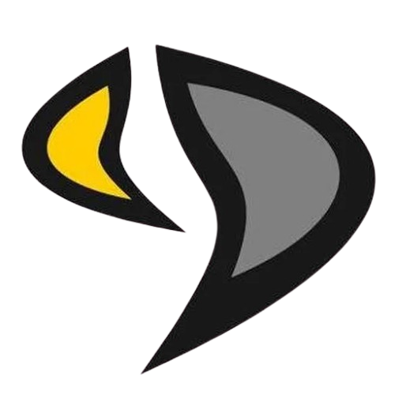

# ProGan - Data augmentation for tumor lesion detection in mammography images

Progressive generation of mammography images using Generative Adversarial Networks (ProGAN).  
This project was developed as a Bachelor's Degree Project in GIIIC at UEX.

## 📌 Description

This project implements and trains a **Progressive Growing GAN (ProGAN)** model for generating synthetic mammography images. The goal is to contribute to the field of medical imaging and deep learning by providing a dataset of synthetic mammogram images that could be used in further research and development.

---
## 🛠️ Installation

1. Clone this repository:
    ```bash
    git clone https://github.com/T3lm0/ProGan.git
    cd ProGAN
    ```
2. Install dependencies:
    ```bash
    pip install -r requirements.txt
    ```
---

## 🖼️ Generate Images Using the Graphical Interface (GUI)

You can easily generate synthetic images using the included graphical interface. Follow these steps:

1. Run the graphical application:
    ```bash
    python generate_imgs.py
    ```

2. In the window that appears:
    - Select the trained model file (`.pth`).
    - Choose the folder where the generated images will be saved.
    - Adjust the parameters:
      - **Z_DIM**: Latent vector dimension (default is 512).
      - **Number of Images**: Number of images to generate.
      - **Image Size**: Image size (must be a power of 2, e.g., 256 for 256x256).
    - Click **Generate Images**.

3. The generated images will appear in the selected output folder.

---

## 📥 Models to Download

You can access and download the trained ProGAN models for mammography from the following links on Hugging Face:

* **ProGAN-Mammography-Nodules**
    [](https://huggingface.co/T3lm0/ProGAN-Mammography-Nodules)

* **ProGAN-Mammography-Calcifications**
    [](https://huggingface.co/T3lm0/ProGAN-Mammography-Calcifications)

* **ProGAN-Mammography-NonLesion-General**
    [](https://huggingface.co/T3lm0/ProGAN-Mammography-NonLesion-General)

---


<div style="display: flex; justify-content: space-between; align-items: flex-start; width: 100%; margin-bottom: 20px;">
    
    
</div>
