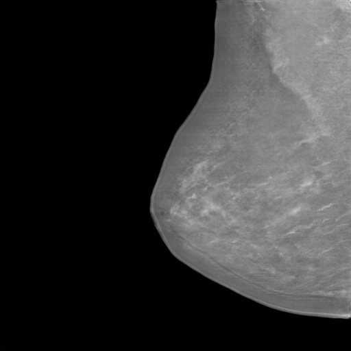
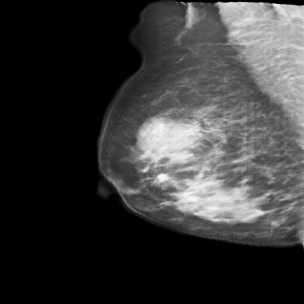

# ProGan - Data augmentation for tumor lesion detection in mammography images

Progressive generation of mammography images using Generative Adversarial Networks (ProGAN).  
This project was developed as a Bachelor's Degree Project in GIIIC at UEX.

## 📌 Description

This project implements and trains a **Progressive Growing GAN (ProGAN)** model for generating synthetic mammography images. The goal is to contribute to the field of medical imaging and deep learning by providing a dataset of synthetic mammogram images that could be used in further research and development.

---
## 🛠️ Installation

1. Clone this repository:
    ```bash
    git clone https://github.com/T3lm0/ProGan.git
    cd ProGAN
    ```
2. Install dependencies:
    ```bash
    pip install -r requirements.txt
    ```
---

## 🖼️ Generate Images Using the Graphical Interface (GUI)

You can easily generate synthetic images using the included graphical interface. Follow these steps:

1. Run the graphical application:
    ```bash
    python generate_imgs.py
    ```

2. In the window that appears:
    - Select the trained model file (`.pth`).
    - Choose the folder where the generated images will be saved.
    - Adjust the parameters:
      - **Z_DIM**: Latent vector dimension (default is 512).
      - **Number of Images**: Number of images to generate.
      - **Image Size**: Image size (must be a power of 2, e.g., 256 for 256x256).
    - Click **Generate Images**.

3. The generated images will appear in the selected output folder.

---
## 📊 Performance Comparison  
**Training With vs. Without Synthetic Images**

This table shows how adding synthetic images affects performance.  
 

<table>
<thead>
<tr>
<th>Architecture</th>
<th>Weighted-Score (%)</th>
<th>Precision (%)</th>
<th>Recall (%)</th>
<th>F1-Score (%)</th>
<th>AUC-ROC (%)</th>
<th>Accuracy (%)</th>
</tr>
</thead>
<tbody>
<tr>
<td><b>CustomDenseNet</b></td>
<td>❌ -2.10</td>
<td>✔️ +23.18</td>
<td>❌ -14.29</td>
<td>✔️ +5.79</td>
<td>❌ -2.8</td>
<td>✔️ +5.46</td>
</tr>
<tr>
<td><b>CustomMobileNetV3</b></td>
<td>✔️ +0.08</td>
<td>✔️ +12.17</td>
<td>❌ -6.12</td>
<td>✔️ +3.72</td>
<td>✔️ +0.34</td>
<td>✔️ +4.98</td>
</tr>
<tr>
<td><b>CustomResNetBinary</b></td>
<td>❌ -2.75</td>
<td>✔️ +13.67</td>
<td>❌ -12.02</td>
<td>✔️ +1.75</td>
<td>❌ -0.95</td>
<td>✔️ +6.99</td>
</tr>
<tr>
<td><b>CustomResNetBinary34</b></td>
<td>❌ -3.06</td>
<td>✔️ +12.47</td>
<td>❌ -14.29</td>
<td>✔️ +2.45</td>
<td>❌ -0.18</td>
<td>✔️ +9.96</td>
</tr>
<tr>
<td><b>CustomResNetBinary50</b></td>
<td>✔️ +1.23</td>
<td>🌟 <b style="color:green">+33.99</b></td>
<td>❌ -12.70</td>
<td>✔️ +8.39</td>
<td>✔️ +2.05</td>
<td>✔️ +12.64</td>
</tr>
<tr>
<td><b>EfficientNetB0</b></td>
<td>❌ -3.78</td>
<td>✔️ +16.46</td>
<td>❌ -13.83</td>
<td>✔️ +1.61</td>
<td>❌ -2.89</td>
<td>✔️ +4.98</td>
</tr>
<tr>
<td><b>VGG16</b></td>
<td>❌ -4.15</td>
<td>✔️ +9.32</td>
<td>❌ -13.38</td>
<td>✔️ +1.01</td>
<td>❌ -2.70</td>
<td>✔️ +4.98</td>
</tr>
</tbody>
</table>

---

👉 **Highlights:**  
- 🌟 **CustomResNetBinary50** had the biggest boost in **Precision (+33.99%)** and **Accuracy (+12.64%)**.  
- ❌ Most architectures lost **Recall**, suggesting synthetic images trade sensitivity for precision.  

## 🖼️ Example Synthetic Images  

Below are examples of synthetic mammography images generated with **ProGAN**:

<div style="display: flex; justify-content: center; gap: 20px; margin-top: 20px;">
    <figure style="text-align: center;">
        
        <figcaption><b>Calcifications</b></figcaption>
    </figure>
    <figure style="text-align: center;">
        
        <figcaption><b>Nodules</b></figcaption>
    </figure>
</div>

## 📥 Models to Download

You can access and download the trained ProGAN models for mammography from the following links on Hugging Face:

* **ProGAN-Mammography-Nodules**
    [](https://huggingface.co/T3lm0/ProGAN-Mammography-Nodules)

* **ProGAN-Mammography-Calcifications**
    [](https://huggingface.co/T3lm0/ProGAN-Mammography-Calcifications)

* **ProGAN-Mammography-NonLesion-General**
    [](https://huggingface.co/T3lm0/ProGAN-Mammography-NonLesion-General)

---

## 📜 License  

This project is licensed under the **Creative Commons Attribution 4.0 International (CC BY 4.0)** license.  
You are free to:  
- **Share** — copy and redistribute the material in any medium or format  
- **Adapt** — remix, transform, and build upon the material for any purpose, even commercially  

As long as you give appropriate credit to the original author.  

For more details, see the [LICENSE](https://creativecommons.org/licenses/by/4.0/).  

---

## 🙏 Acknowledgements  

This work was developed as part of my **Bachelor’s Degree Final Project (TFG)** in *Grado en Ingeniería Informática en Ingeniería de Computadores (GIIIC)* at the **University of Extremadura (UEx)**.  

I would like to thank:  
- My TFG supervisor [**Pilar Bachiller Burgos**](https://github.com/pilarbachiller).  
- My co-supervisor [**José Luis García Salas**](https://github.com/jlgs96). 
- The **Escuela Politécnica de Cáceres (EPCC)**, and in particular the [**RoboLab Research Group**](https://robolab.unex.es/), for providing resources, facilities, and an excellent research environment.  
- My colleagues, friends, and family for their continuous encouragement throughout this project.  

---

<div style="display: flex; justify-content: space-between; align-items: flex-start; width: 100%; margin-bottom: 20px;">
    
    
</div>
